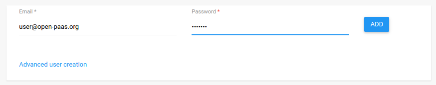

## 1. Users management:

 This **Users management guide** instructs you to manage users as administrator.
 Go to the **Administration Center**, there are **Users Management**, **Role Management** that allow admin to be able to      manage users such as creating a new user, promoting users to admin role and revoking a user’s admin role.
 
  
 
 ### 1.1. How to create a new user
 
  You need to click on Users on the left side to go to the **Users Management**.
 
   
 
  Here, you can create a new user with basic information email and password or you can add more information by clicking on     **Advanced user creation**.
  
   
  
  Type email and password in the basic form, and click **Add** to create user.
   
   
  
  Click on **Advanced user creation** to create a new user with more information, type an email, password as require and you   can type more information for user such as *First name, Last name, Job title, Service, Building location,                     Office,location, Main phone, Bio*. And then click **Save** button in the top right-hand corner to create user or you can     cancel by click on **Cancel** in the top left-hand corner.
  
   
  
  After click **Add** in user basic form or Save in Advanced User Creation, there will be a toast message to notice user       was created *fail* or *succeed*.
  
   
   
   
  
  After creating user, the user will be appeared in users list below the basic user creating form.
   
   

 ### 1.2. How to promote users to admin role

  Click on **Roles** in **Administration Center** to go to the Roles Management.

   

  To make a user to become an Administrator, click on the **Add** button in the bottom right-hand corner, a modal **Add         Administrators** will immediately appear right then. 
  We can type full username or email or just some letters of username or email, the system will automatically suggest user     for Admin, so Admin can choose who will be an admin. And then click on **Add** button of modal to add administrator. Or       click on close to close the modal.

   

   

  When we find an user in the modal **Add Administrators**, the users suggestion list will not include any user who is         admin.
  After clicking **Add**, there is a toast message to notice user was added sucessfully or failed, if succeed the user will     become an admin and will be shown on Administrators list.

   

 
 ### 1.3. How to revoke a user’s admin role

  At the **Roles Management**, there are a administrators list, so the admin can revoke other admins but himself to become a   normal user. We can see every admin has   their own **delete** icon except admin himself. To revoke, click on **delete**     icon of admin that want to revoke. An modal notification **Revoke administrator?** will be shown to be sure, click on         **Revoke** red button to continue revoking, click on **Cancel** button to cancel.

   

  After revoking admin, the admin will become an normal user, an toast message will be shown to notice admin was revoked       sucessfully or failed and obviously this former admin will not be shown in administrators list. 
  
   

